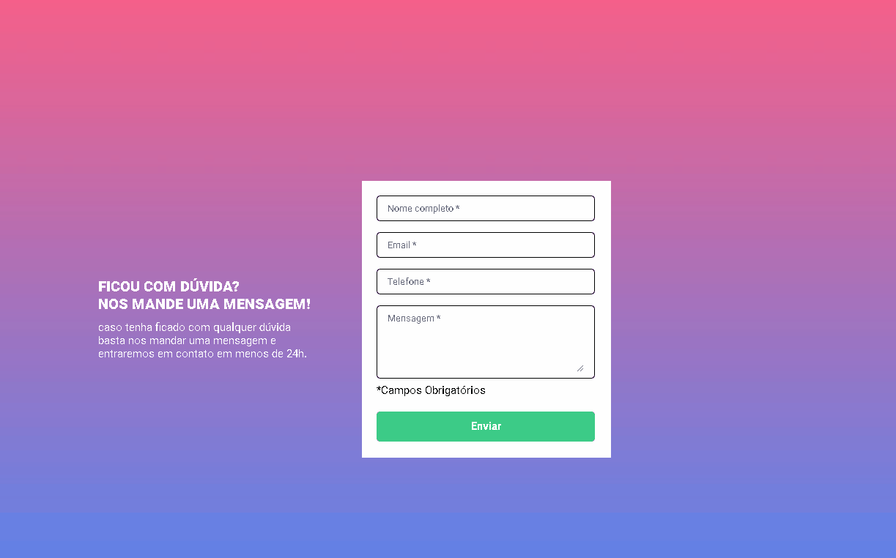

# Validação de Formulário com JavaScript

## Visão geral

Este é um desafio do módulo de front-end do curso DevQuest do canal Dev em Dobro. O objetivo deste desafio é realizar a validação de um formulário através do JavaScript com as seguintes exigências:

- A validação do formulário deve ser feita com
javascript puro.
- Ao clicar para enviar o formulário, se caso
algum campo não estiver preenchido, a borda
do input deve ficar vermelha e uma mensagem
de "campo obrigatório" deve aparecer embaixo
do campo que não foi preenchido, conforme o
figma.
- O fundo do formulário deve ser feito usando a
imagem em anexo na aula.

### Resultado

<<<<<<< HEAD

[Formulário de Validação com JS](https://guilherme-dangelo.github.io/formulario-com-js-intermediario/)
=======
>>>>>>> 4932a7b2bfe5d34a4430d6186a25030301f5d708

## Meu processo

### Feito com:

- Marcação semântica HTML
- CSS
- JavaScript

### O que eu aprendi:

Com esse desafio, eu aprendi a importância de se ter um HTML guiado á objetos que seja organizado e simples de entender,  também aprendi a trabalhar melhor com as resoluções de diferentes dispositivos e por consequência, melhorei a responsividade da minha página web, utilizando CSS.

## Autor

- Github - [Guilherme D'Angelo](https://github.com/Guilherme-DAngelo)
- Linkedin - [Guilherme D'Angelo](https://www.linkedin.com/in/guilherme-d-655705218/)
